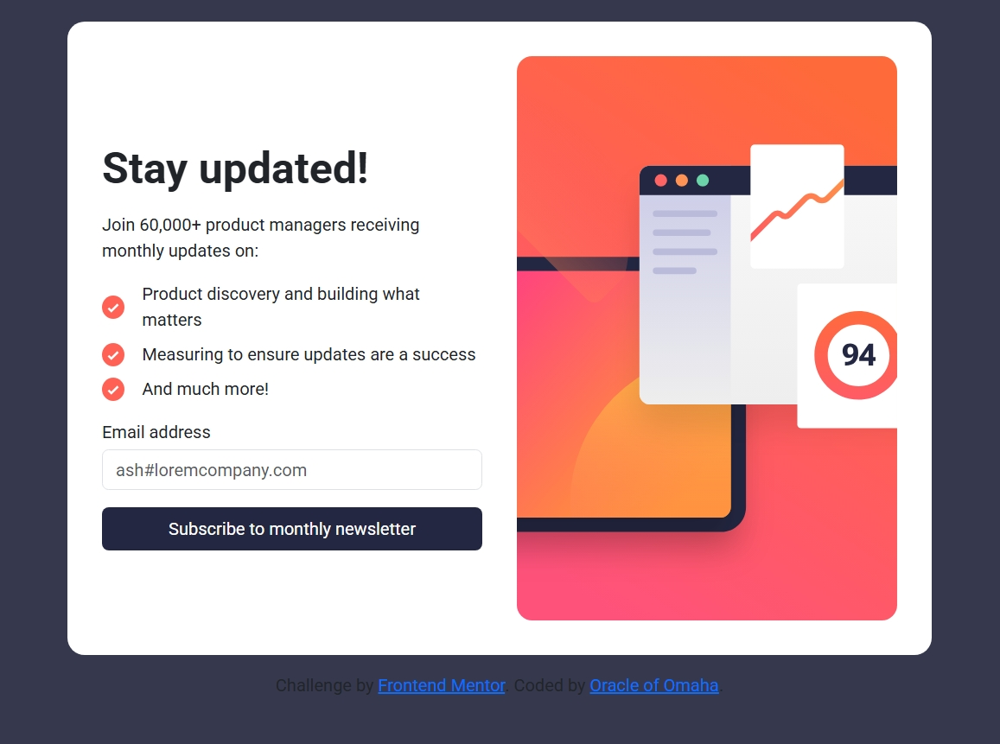
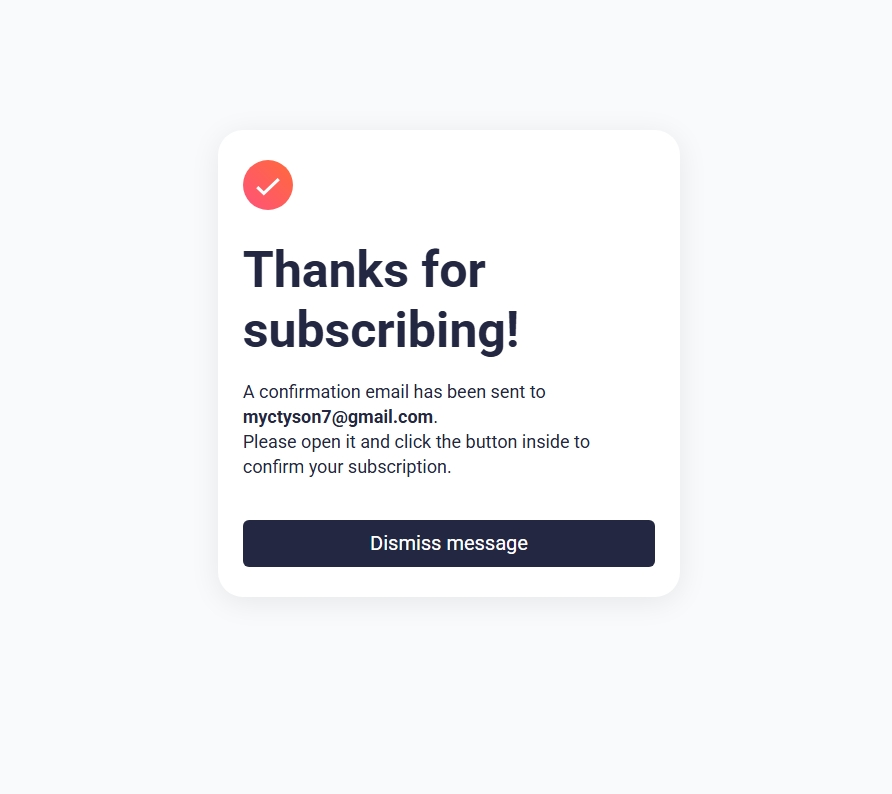

# Frontend Mentor - Newsletter sign-up form with success message solution

This is a solution to the [Newsletter sign-up form with success message challenge on Frontend Mentor](https://www.frontendmentor.io/challenges/newsletter-signup-form-with-success-message-3FC1AZbNrv). Frontend Mentor challenges help you improve your coding skills by building realistic projects. 

## Table of contents

- [Overview](#overview)
  - [The challenge](#the-challenge)
  - [Screenshot](#screenshot)
  - [Links](#links)
- [My process](#my-process)
  - [Built with](#built-with)
  - [What I learned](#what-i-learned)
  - [Continued development](#continued-development)
- [Author](#author)
- [Acknowledgments](#acknowledgments)

## Overview
This project is about a responsive newspaper signup. a form that gets user email and sends them some informaion and then gives the user feedback.
### The challenge

Users should be able to:

- Add their email and submit the form
- See a success message with their email after successfully submitting the form
- See form validation messages if:
  - The field is left empty
  - The email address is not formatted correctly
- View the optimal layout for the interface depending on their device's screen size
- See hover and focus states for all interactive elements on the page

### Screenshot

### Links

- Solution URL: [Add solution URL here](https://your-solution-url.com)
- Live Site URL: [Add live site URL here](https://your-live-site-url.com)

## My process
- started with the mobile designs then desktop designs.
- I used two separate html files and javascript files to handle the email capture and the success message pages.
- I made the main page a flex container with column for mobile and row display for desktops. 
- I used custom css and bootstrap css to style both pages.
- I used custom javascript to provide functionality to my webpages.
- I used chatGPT in debuging.
- I ran tests on Edge, vivo browser and chrome.

### Built with

- Semantic HTML5 markup
- CSS custom properties
- Flexbox
- CSS Grid
- Mobile-first workflow

### What I learned

I learned how to store and get data locally with on the client side using javascript.
- I learned how to direct user to a different page based on click events.
### Continued development

I want to continue developing on responsive designs.
- I want to continue developing my DOM manipulation knowledge.
- improve my knowledge on handling forms.

## Author

- Website - [Add your name here](https://www.your-site.com)
- Frontend Mentor - [@Rodney-Mokenyu](https://www.frontendmentor.io/profile/Rodney-Mokenyu)

## Acknowledgments

This project was crafted to sharpen my front-end development skills, with a focus on responsive design, form validation, and clean UI structure. It was a great opportunity to apply modern HTML, CSS, and JavaScript techniques. Thanks to Frontend Mentor for the inspiration!
